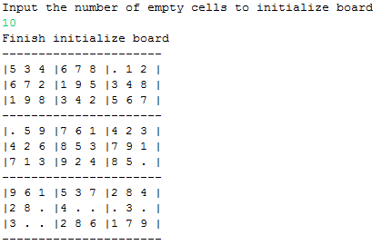
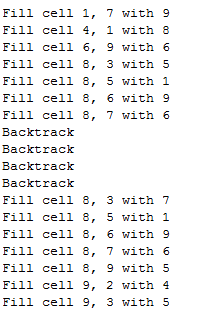
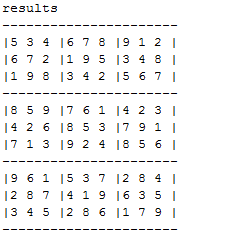

# Sudoku Solver
### A sudoku puzzle solver utilizing a recursive backtracking algorithm

Initializing the sudoku board

Log of different possible solutions and backtracks done by the program

Successfully solved sudoku puzzle is outputted at the end
